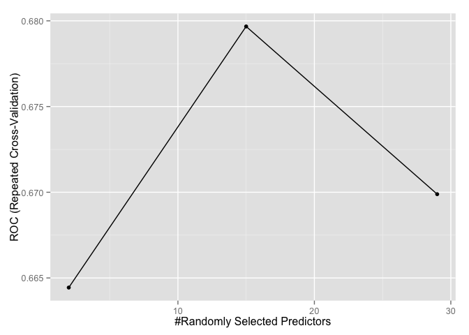
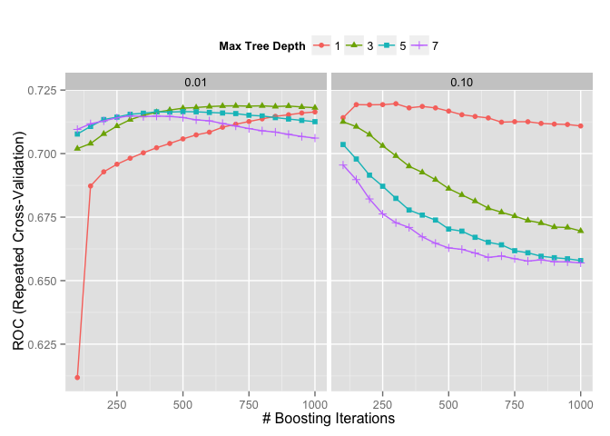

# Bank Marketing Model
Rashan Jibowu  
May 18, 2015  

This document details how a model was built using data from the UCI Machine Learning data repository. Our aim is to predict whether a customer is likely to open up a bank account.

Require necessary packages


```r
library(plyr)
library(caret)
```

```
## Loading required package: lattice
## Loading required package: ggplot2
```

```r
library(ggplot2)
library(lattice)
```

Load and summarize the data


```r
data <- read.csv("./data/bank/bank.csv", sep = ";")
str(data)
```

```
## 'data.frame':	4521 obs. of  17 variables:
##  $ age      : int  30 33 35 30 59 35 36 39 41 43 ...
##  $ job      : Factor w/ 12 levels "admin.","blue-collar",..: 11 8 5 5 2 5 7 10 3 8 ...
##  $ marital  : Factor w/ 3 levels "divorced","married",..: 2 2 3 2 2 3 2 2 2 2 ...
##  $ education: Factor w/ 4 levels "primary","secondary",..: 1 2 3 3 2 3 3 2 3 1 ...
##  $ default  : Factor w/ 2 levels "no","yes": 1 1 1 1 1 1 1 1 1 1 ...
##  $ balance  : int  1787 4789 1350 1476 0 747 307 147 221 -88 ...
##  $ housing  : Factor w/ 2 levels "no","yes": 1 2 2 2 2 1 2 2 2 2 ...
##  $ loan     : Factor w/ 2 levels "no","yes": 1 2 1 2 1 1 1 1 1 2 ...
##  $ contact  : Factor w/ 3 levels "cellular","telephone",..: 1 1 1 3 3 1 1 1 3 1 ...
##  $ day      : int  19 11 16 3 5 23 14 6 14 17 ...
##  $ month    : Factor w/ 12 levels "apr","aug","dec",..: 11 9 1 7 9 4 9 9 9 1 ...
##  $ duration : int  79 220 185 199 226 141 341 151 57 313 ...
##  $ campaign : int  1 1 1 4 1 2 1 2 2 1 ...
##  $ pdays    : int  -1 339 330 -1 -1 176 330 -1 -1 147 ...
##  $ previous : int  0 4 1 0 0 3 2 0 0 2 ...
##  $ poutcome : Factor w/ 4 levels "failure","other",..: 4 1 1 4 4 1 2 4 4 1 ...
##  $ y        : Factor w/ 2 levels "no","yes": 1 1 1 1 1 1 1 1 1 1 ...
```

```r
summary(data)
```

```
##       age                 job          marital         education   
##  Min.   :19.00   management :969   divorced: 528   primary  : 678  
##  1st Qu.:33.00   blue-collar:946   married :2797   secondary:2306  
##  Median :39.00   technician :768   single  :1196   tertiary :1350  
##  Mean   :41.17   admin.     :478                   unknown  : 187  
##  3rd Qu.:49.00   services   :417                                   
##  Max.   :87.00   retired    :230                                   
##                  (Other)    :713                                   
##  default       balance      housing     loan           contact    
##  no :4445   Min.   :-3313   no :1962   no :3830   cellular :2896  
##  yes:  76   1st Qu.:   69   yes:2559   yes: 691   telephone: 301  
##             Median :  444                         unknown  :1324  
##             Mean   : 1423                                         
##             3rd Qu.: 1480                                         
##             Max.   :71188                                         
##                                                                   
##       day            month         duration       campaign     
##  Min.   : 1.00   may    :1398   Min.   :   4   Min.   : 1.000  
##  1st Qu.: 9.00   jul    : 706   1st Qu.: 104   1st Qu.: 1.000  
##  Median :16.00   aug    : 633   Median : 185   Median : 2.000  
##  Mean   :15.92   jun    : 531   Mean   : 264   Mean   : 2.794  
##  3rd Qu.:21.00   nov    : 389   3rd Qu.: 329   3rd Qu.: 3.000  
##  Max.   :31.00   apr    : 293   Max.   :3025   Max.   :50.000  
##                  (Other): 571                                  
##      pdays           previous          poutcome      y       
##  Min.   : -1.00   Min.   : 0.0000   failure: 490   no :4000  
##  1st Qu.: -1.00   1st Qu.: 0.0000   other  : 197   yes: 521  
##  Median : -1.00   Median : 0.0000   success: 129             
##  Mean   : 39.77   Mean   : 0.5426   unknown:3705             
##  3rd Qu.: -1.00   3rd Qu.: 0.0000                            
##  Max.   :871.00   Max.   :25.0000                            
## 
```

Clean the data


```r
data <- rename(data, c("default" = "in_default",
                       "housing" = "housing_loan",
                       "loan" = "personal_loan",
                       "contact" = "last_contact_type",
                       "month" = "last_contact_month",
                       "day" = "last_contact_dayofweek",
                       "duration" = "last_contact_duration",
                       "campaign" = "contact_count",
                       "pdays" = "days_since_last_contact",
                       "previous" = "prev_campaigns_contact_count",
                       "poutcome" = "previous_outcome")
       )

# remove data that should have no bearing (time of last contact and duration)
data <- data[, -(10:12)]

names(data)
```

```
##  [1] "age"                          "job"                         
##  [3] "marital"                      "education"                   
##  [5] "in_default"                   "balance"                     
##  [7] "housing_loan"                 "personal_loan"               
##  [9] "last_contact_type"            "contact_count"               
## [11] "days_since_last_contact"      "prev_campaigns_contact_count"
## [13] "previous_outcome"             "y"
```

#### Exploratory Data Analysis

Relationship with Age


```r
g <- ggplot(aes(x = age, y = in_default, color = y), data = data)
g + geom_point()
```

 

Relationship with Job and Age


```r
g <- ggplot(aes(x = age, y = job, color = y), data = data)
g + geom_point()
```

 

Relationship with Balance


```r
g <- ggplot(aes(x = balance, y = age, color = y), data = data)
g + geom_point()
```

 

Let's try the following models:

1. Random Forest Model
2. Regularized Discriminant Analysis
3. Gradient Boosted Trees
4. Partial Least Squares
5. Naive Bayes
6. Neural Network
7. Logistic Regression
8. Boosted Logistic Regression 

Partition the Data


```r
set.seed(123)

inTrain <- createDataPartition(y = data$y, p = 0.75, list = FALSE)
training <- data[inTrain, ]
testing <- data[-inTrain, ]

dim(training)
```

```
## [1] 3391   14
```

```r
dim(testing)
```

```
## [1] 1130   14
```

Set model parameters


```r
fitControl <- trainControl(method = "repeatedcv",
                           number = 3,
                           repeats = 10,
                           allowParallel = TRUE,
                           savePredictions = TRUE,
                           classProbs = TRUE,
                           summaryFunction = twoClassSummary)

metric <- c("ROC")
```

Random Forest


```r
system.time(rf.fit <- train(y ~., 
                            data = training, 
                            method = "rf",
                            trControl = fitControl,
                            metric = metric
                            )
            )
```

```
##    user  system elapsed 
## 282.565   3.203 286.167
```

```r
ggplot(rf.fit) + theme(legend.position = "top")
```

 

Regularized Discriminant Analysis


```r
#system.time(rda.fit <- train(y ~ ., 
 #                            data = training, 
  #                           method = "rda",
   #                          metric = metric,
    #                         trControl = fitControl)
     #       )

#plot(rda.fit)
```

Gradient Boosted Trees


```r
grid <- expand.grid(interaction.depth = seq(1, 7, by = 2),
                    n.trees = seq(100, 1000, by = 50),
                    shrinkage = c(0.01, 0.1),
                    n.minobsinnode = 10)

system.time(gbm.fit <- train(y ~ ., 
                             data = training, 
                             method = "gbm", 
                             trControl = fitControl,
                             tuneGrid = grid,
                             metric = metric,
                             verbose = FALSE)
            )
```

```
##    user  system elapsed 
## 764.449   5.701 770.241
```

```r
plot(gbm.fit)
```

 

```r
ggplot(gbm.fit) + theme(legend.position = "top")
```

 

Partial Least Squares Model


```r
#system.time(pls.fit <- train(y ~ ., 
 #                            data = training, 
  #                           method = "pls",
   #                          metric = metric
    #                         )
     #       )

#plot(pls.fit)
```

Naive Bayes


```r
#system.time(nb.fit <- train(formula = formula,
 #                           data = training,
  #                          method = "nb", 
   #                         metric = metric, 
    #                        trControl = fitControl)
     #       )

#plot(nb.fit)
```

Neural Network


```r
#system.time(nn.fit <- train(formula = formula,
     #                       data = training,
    #                        method = "nnet",
   #                         metric = metric,
  #                          trControl = fitControl)
 #           )

#plot(nn.fit)
```

Logistic Regression


```r
system.time(glmfit <- glm(y ~ ., data = training, family = "binomial"))
```

```
##    user  system elapsed 
##   0.040   0.003   0.043
```

```r
print(glmfit)
```

```
## 
## Call:  glm(formula = y ~ ., family = "binomial", data = training)
## 
## Coefficients:
##                  (Intercept)                           age  
##                   -1.271e+00                     6.647e-03  
##               jobblue-collar               jobentrepreneur  
##                   -1.267e-01                    -2.103e-02  
##                 jobhousemaid                 jobmanagement  
##                    9.901e-02                    -9.633e-02  
##                   jobretired              jobself-employed  
##                    5.459e-01                     2.902e-02  
##                  jobservices                    jobstudent  
##                   -1.807e-01                     2.002e-01  
##                jobtechnician                 jobunemployed  
##                   -3.021e-01                    -2.021e-01  
##                   jobunknown                maritalmarried  
##                    1.551e-01                    -4.307e-01  
##                maritalsingle            educationsecondary  
##                   -8.825e-02                     8.748e-02  
##            educationtertiary              educationunknown  
##                    3.624e-01                    -2.931e-01  
##                in_defaultyes                       balance  
##                    2.745e-01                    -4.791e-06  
##              housing_loanyes              personal_loanyes  
##                   -3.516e-01                    -5.471e-01  
##   last_contact_typetelephone      last_contact_typeunknown  
##                   -1.813e-01                    -8.411e-01  
##                contact_count       days_since_last_contact  
##                   -7.445e-02                    -1.209e-03  
## prev_campaigns_contact_count         previous_outcomeother  
##                    2.236e-02                     4.540e-01  
##      previous_outcomesuccess       previous_outcomeunknown  
##                    2.064e+00                    -4.089e-01  
## 
## Degrees of Freedom: 3390 Total (i.e. Null);  3361 Residual
## Null Deviance:	    2424 
## Residual Deviance: 2155 	AIC: 2215
```

Boosted Logistic Regression


```r
#system.time(blogit.fit <- train(formula = formula,
#                                data = training,
#                                method = "LogitBoost",
#                                metric = metric,
#                                trControl = fitControl)
#            )

#plot(blogit.fit)
```

Evaluation


```r
# Random Forest
rf.pred <- predict(rf.fit, newdata = training)
confusionMatrix(data = rf.pred, reference = training$y, positive = "yes")
```

```
## Confusion Matrix and Statistics
## 
##           Reference
## Prediction   no  yes
##        no  3000    1
##        yes    0  390
##                                      
##                Accuracy : 0.9997     
##                  95% CI : (0.9984, 1)
##     No Information Rate : 0.8847     
##     P-Value [Acc > NIR] : <2e-16     
##                                      
##                   Kappa : 0.9986     
##  Mcnemar's Test P-Value : 1          
##                                      
##             Sensitivity : 0.9974     
##             Specificity : 1.0000     
##          Pos Pred Value : 1.0000     
##          Neg Pred Value : 0.9997     
##              Prevalence : 0.1153     
##          Detection Rate : 0.1150     
##    Detection Prevalence : 0.1150     
##       Balanced Accuracy : 0.9987     
##                                      
##        'Positive' Class : yes        
## 
```

```r
rf.pred.test <- predict(rf.fit, newdata = testing)
confusionMatrix(data = rf.pred.test, reference = testing$y, positive = "yes")
```

```
## Confusion Matrix and Statistics
## 
##           Reference
## Prediction  no yes
##        no  987 102
##        yes  13  28
##                                           
##                Accuracy : 0.8982          
##                  95% CI : (0.8791, 0.9152)
##     No Information Rate : 0.885           
##     P-Value [Acc > NIR] : 0.08651         
##                                           
##                   Kappa : 0.2882          
##  Mcnemar's Test P-Value : 2.286e-16       
##                                           
##             Sensitivity : 0.21538         
##             Specificity : 0.98700         
##          Pos Pred Value : 0.68293         
##          Neg Pred Value : 0.90634         
##              Prevalence : 0.11504         
##          Detection Rate : 0.02478         
##    Detection Prevalence : 0.03628         
##       Balanced Accuracy : 0.60119         
##                                           
##        'Positive' Class : yes             
## 
```

```r
# Regularized Discriminant Analysis
#rda.pred <- predict(rda.fit, newdata = training)
#confusionMatrix(rda.pred, training$y)

# Gradient Boosted Trees
gbm.pred <- predict(gbm.fit, newdata = training)
confusionMatrix(data = gbm.pred, reference = training$y, positive = "yes")
```

```
## Confusion Matrix and Statistics
## 
##           Reference
## Prediction   no  yes
##        no  2972  334
##        yes   28   57
##                                           
##                Accuracy : 0.8932          
##                  95% CI : (0.8824, 0.9034)
##     No Information Rate : 0.8847          
##     P-Value [Acc > NIR] : 0.06153         
##                                           
##                   Kappa : 0.2068          
##  Mcnemar's Test P-Value : < 2e-16         
##                                           
##             Sensitivity : 0.14578         
##             Specificity : 0.99067         
##          Pos Pred Value : 0.67059         
##          Neg Pred Value : 0.89897         
##              Prevalence : 0.11531         
##          Detection Rate : 0.01681         
##    Detection Prevalence : 0.02507         
##       Balanced Accuracy : 0.56822         
##                                           
##        'Positive' Class : yes             
## 
```

```r
# Partial Least Squares
#pls.pred <- predict(pls.fit, newdata = training)
#confusionMatrix(pls.pred, training$y)

# Naive Bayes
#nb.pred <- predict(nb.fit, newdata = training)
#confusionMatrix(nb.pred, training$y)

# Neural Network
#nn.pred <- predict(nn.fit, newdata = training)
#confusionMatrix(nn.pred, training$y)

# Boosted Logistic Regression
#blogit.pred <- predict(blogit.fit, newdata = training)
#confusionMatrix(blogit.pred, training$y)

#print(rf.fit)
```

Variable Importance


```r
# variable importance
varImp(rf.fit)
```

```
## rf variable importance
## 
##   only 20 most important variables shown (out of 29)
## 
##                              Overall
## balance                      100.000
## age                           70.761
## contact_count                 28.338
## days_since_last_contact       21.684
## previous_outcomesuccess       20.626
## prev_campaigns_contact_count  10.435
## housing_loanyes                9.718
## educationsecondary             8.005
## maritalmarried                 7.470
## jobtechnician                  6.268
## educationtertiary              6.021
## jobblue-collar                 5.877
## jobmanagement                  5.778
## maritalsingle                  5.496
## personal_loanyes               5.009
## last_contact_typeunknown       4.459
## last_contact_typetelephone     3.237
## jobservices                    2.893
## jobself-employed               2.399
## jobretired                     2.077
```

```r
varImp(gbm.fit)
```

```
## gbm variable importance
## 
##   only 20 most important variables shown (out of 29)
## 
##                               Overall
## age                          100.0000
## previous_outcomesuccess       80.5372
## days_since_last_contact       58.2188
## balance                       51.4175
## prev_campaigns_contact_count  29.2377
## last_contact_typeunknown      16.9544
## contact_count                  9.7434
## maritalmarried                 8.7825
## housing_loanyes                8.3277
## previous_outcomeother          7.2125
## educationtertiary              5.2445
## jobretired                     4.8354
## personal_loanyes               3.2247
## jobstudent                     2.1367
## jobmanagement                  1.8882
## jobhousemaid                   1.4028
## last_contact_typetelephone     1.2662
## jobtechnician                  0.6547
## in_defaultyes                  0.5943
## maritalsingle                  0.0000
```
