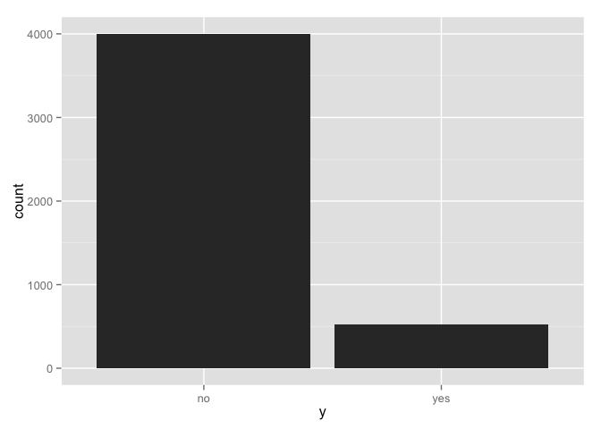
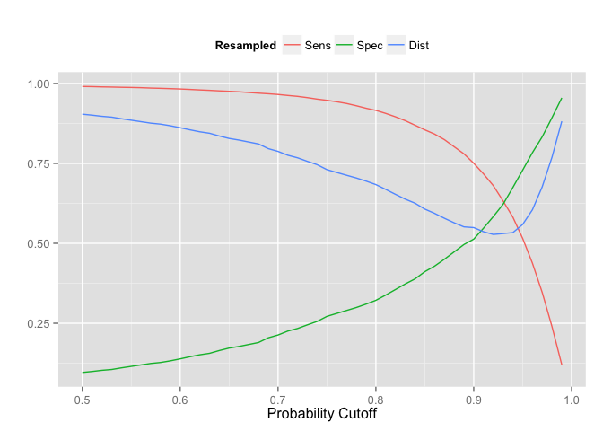
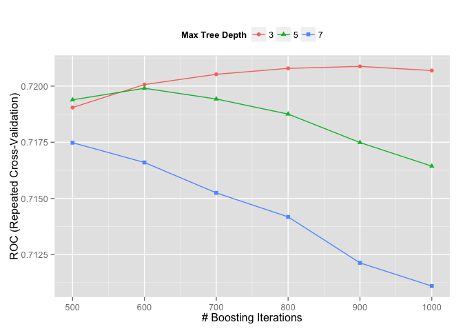
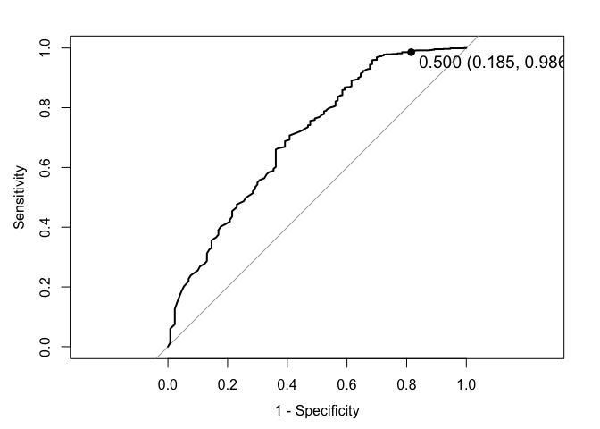
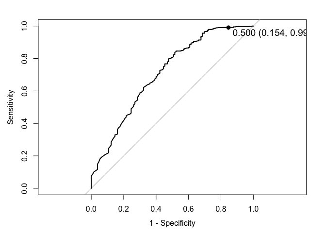
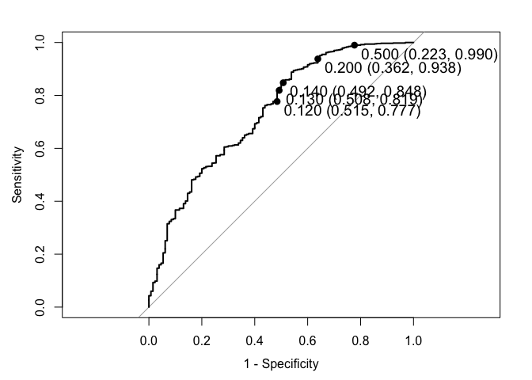
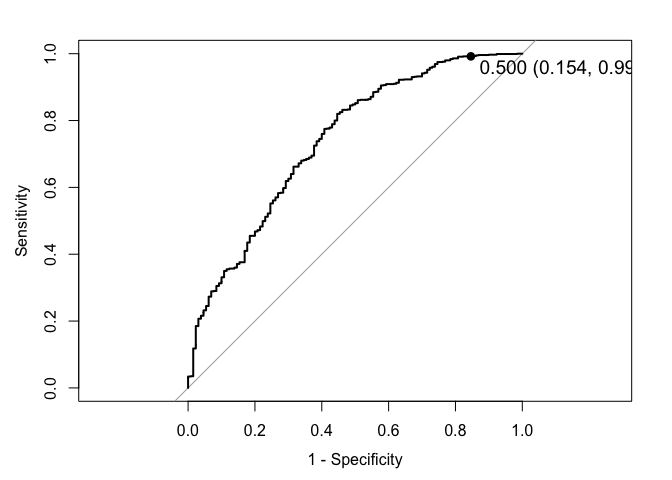
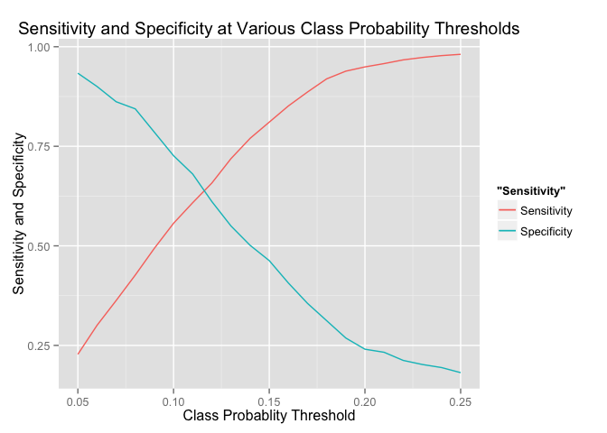
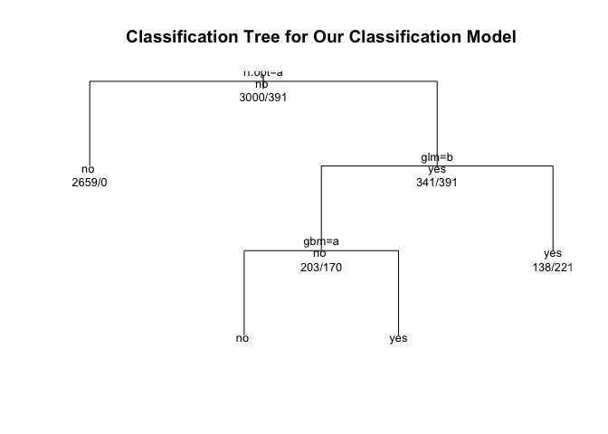

# Bank Marketing Model
Rashan Jibowu  
May 18, 2015  

This document details how a model was built using data from the UCI Machine Learning data repository. Our aim is to predict whether a customer is likely to open up a bank account.

### Preparing the environment

Require necessary packages


```r
require(plyr, quietly = TRUE, warn.conflicts = FALSE)
require(caret, quietly = TRUE, warn.conflicts = FALSE)
require(ggplot2, quietly = TRUE, warn.conflicts = FALSE)
require(lattice, quietly = TRUE, warn.conflicts = FALSE)
require(doParallel, quietly = TRUE, warn.conflicts = FALSE)
suppressWarnings(require(pROC, quietly = TRUE, warn.conflicts = FALSE))
```

```
## Type 'citation("pROC")' for a citation.
```

```r
require(reshape2, quietly = TRUE, warn.conflicts = FALSE)
suppressWarnings(require(randomForest, quietly = TRUE, warn.conflicts = FALSE))
```

```
## randomForest 4.6-10
## Type rfNews() to see new features/changes/bug fixes.
```

```r
require(rpart, quietly = TRUE, warn.conflicts = FALSE)
```

Set up parallel processing


```r
cores = detectCores()

# use all but 1 core to process data
if (cores > 1) {
    cores <- cores - 1
}

registerDoParallel(cores = cores)
```

Load and check the data


```r
data <- read.csv("./data/bank/bank.csv", sep = ";")
str(data)
```

```
## 'data.frame':	4521 obs. of  17 variables:
##  $ age      : int  30 33 35 30 59 35 36 39 41 43 ...
##  $ job      : Factor w/ 12 levels "admin.","blue-collar",..: 11 8 5 5 2 5 7 10 3 8 ...
##  $ marital  : Factor w/ 3 levels "divorced","married",..: 2 2 3 2 2 3 2 2 2 2 ...
##  $ education: Factor w/ 4 levels "primary","secondary",..: 1 2 3 3 2 3 3 2 3 1 ...
##  $ default  : Factor w/ 2 levels "no","yes": 1 1 1 1 1 1 1 1 1 1 ...
##  $ balance  : int  1787 4789 1350 1476 0 747 307 147 221 -88 ...
##  $ housing  : Factor w/ 2 levels "no","yes": 1 2 2 2 2 1 2 2 2 2 ...
##  $ loan     : Factor w/ 2 levels "no","yes": 1 2 1 2 1 1 1 1 1 2 ...
##  $ contact  : Factor w/ 3 levels "cellular","telephone",..: 1 1 1 3 3 1 1 1 3 1 ...
##  $ day      : int  19 11 16 3 5 23 14 6 14 17 ...
##  $ month    : Factor w/ 12 levels "apr","aug","dec",..: 11 9 1 7 9 4 9 9 9 1 ...
##  $ duration : int  79 220 185 199 226 141 341 151 57 313 ...
##  $ campaign : int  1 1 1 4 1 2 1 2 2 1 ...
##  $ pdays    : int  -1 339 330 -1 -1 176 330 -1 -1 147 ...
##  $ previous : int  0 4 1 0 0 3 2 0 0 2 ...
##  $ poutcome : Factor w/ 4 levels "failure","other",..: 4 1 1 4 4 1 2 4 4 1 ...
##  $ y        : Factor w/ 2 levels "no","yes": 1 1 1 1 1 1 1 1 1 1 ...
```

```r
summary(data)
```

```
##       age                 job          marital         education   
##  Min.   :19.00   management :969   divorced: 528   primary  : 678  
##  1st Qu.:33.00   blue-collar:946   married :2797   secondary:2306  
##  Median :39.00   technician :768   single  :1196   tertiary :1350  
##  Mean   :41.17   admin.     :478                   unknown  : 187  
##  3rd Qu.:49.00   services   :417                                   
##  Max.   :87.00   retired    :230                                   
##                  (Other)    :713                                   
##  default       balance      housing     loan           contact    
##  no :4445   Min.   :-3313   no :1962   no :3830   cellular :2896  
##  yes:  76   1st Qu.:   69   yes:2559   yes: 691   telephone: 301  
##             Median :  444                         unknown  :1324  
##             Mean   : 1423                                         
##             3rd Qu.: 1480                                         
##             Max.   :71188                                         
##                                                                   
##       day            month         duration       campaign     
##  Min.   : 1.00   may    :1398   Min.   :   4   Min.   : 1.000  
##  1st Qu.: 9.00   jul    : 706   1st Qu.: 104   1st Qu.: 1.000  
##  Median :16.00   aug    : 633   Median : 185   Median : 2.000  
##  Mean   :15.92   jun    : 531   Mean   : 264   Mean   : 2.794  
##  3rd Qu.:21.00   nov    : 389   3rd Qu.: 329   3rd Qu.: 3.000  
##  Max.   :31.00   apr    : 293   Max.   :3025   Max.   :50.000  
##                  (Other): 571                                  
##      pdays           previous          poutcome      y       
##  Min.   : -1.00   Min.   : 0.0000   failure: 490   no :4000  
##  1st Qu.: -1.00   1st Qu.: 0.0000   other  : 197   yes: 521  
##  Median : -1.00   Median : 0.0000   success: 129             
##  Mean   : 39.77   Mean   : 0.5426   unknown:3705             
##  3rd Qu.: -1.00   3rd Qu.: 0.0000                            
##  Max.   :871.00   Max.   :25.0000                            
## 
```

### Clean the data

Based on the details from the data source, let's rename the variables to provide better context.


```r
data <- rename(data, c("default" = "in_default",
                       "housing" = "housing_loan",
                       "loan" = "personal_loan",
                       "contact" = "last_contact_type",
                       "month" = "last_contact_month",
                       "day" = "last_contact_dayofweek",
                       "duration" = "last_contact_duration",
                       "campaign" = "contact_count",
                       "pdays" = "days_since_last_contact",
                       "previous" = "prev_campaigns_contact_count",
                       "poutcome" = "previous_outcome")
       )
```

We should also remove variables that ought not to be part of the modelling. For example, we won't knw in advance the duration of a phone call. Call duration is generally dependent on the outcome, not predictive of it.


```r
# remove data that should have no bearing (time of last contact and duration)
data <- data[, -(10:12)]

names(data)
```

```
##  [1] "age"                          "job"                         
##  [3] "marital"                      "education"                   
##  [5] "in_default"                   "balance"                     
##  [7] "housing_loan"                 "personal_loan"               
##  [9] "last_contact_type"            "contact_count"               
## [11] "days_since_last_contact"      "prev_campaigns_contact_count"
## [13] "previous_outcome"             "y"
```

#### Exploratory Data Analysis

Histogram of target variable


```r
ggplot(data = data, aes(y)) + geom_histogram()
```

 

The distribution of the target variable is quite unbalanced. We'll need to address this later when we get to the model building stage.


```r
table(data$y)
```

```
## 
##   no  yes 
## 4000  521
```

Relationship with Age


```r
g <- ggplot(aes(x = age, y = in_default, color = y), data = data)
g + geom_point()
```

 

Relationship with Job and Age


```r
g <- ggplot(aes(x = age, y = job, color = y), data = data)
g + geom_point()
```

 

Relationship with Account Balance


```r
g <- ggplot(aes(x = balance, y = age, color = y), data = data)
g + geom_point()
```

 

Let's try the following models:

1. Random Forest Model
2. Optimized version of Random Forest (to deal with imbalanced class distribution in target variable)
3. Gradient Boosted Machines
4. Logistic Regression

Partition the Data


```r
set.seed(123)

inTrain <- createDataPartition(y = data$y, p = 0.75, list = FALSE)
training <- data[inTrain, ]
testing <- data[-inTrain, ]

dim(training)
```

```
## [1] 3391   14
```

```r
dim(testing)
```

```
## [1] 1130   14
```

Set model parameters


```r
fitControl <- trainControl(method = "repeatedcv",
                           number = 3,
                           repeats = 10,
                           allowParallel = TRUE,
                           savePredictions = TRUE,
                           classProbs = TRUE,
                           summaryFunction = twoClassSummary)

metric <- c("ROC")
```

Random Forest Model


```r
rf.fit <- train(y ~., 
                data = training, 
                method = "rf",
                trControl = fitControl,
                metric = metric
                )
```

Optimized Random Forest Model

This optimization procedure is adapted from Max Kuhn, who details the procedure [here](http://topepo.github.io/caret/custom_models.html)


```r
## Get the model code for the original random forest method:
thresh_code <- getModelInfo("rf", regex = FALSE)[[1]]
thresh_code$type <- c("Classification")

## Add the threshold as another tuning parameter
thresh_code$parameters <- data.frame(parameter = c("mtry", "threshold"),
                                     class = c("numeric", "numeric"),
                                     label = c("#Randomly Selected Predictors",
                                               "Probability Cutoff"))
## The default tuning grid code:
thresh_code$grid <- function(x, y, len = NULL) {
  p <- ncol(x)
  expand.grid(mtry = floor(sqrt(p)),
              threshold = seq(.5, .99, by = .01))
  }

## Here we fit a single random forest model (with a fixed mtry)
## and loop over the threshold values to get predictions from the same
## randomForest model.
thresh_code$loop = function(grid) {
                 library(plyr)
                 loop <- ddply(grid, c("mtry"),
                               function(x) c(threshold = max(x$threshold)))
                 submodels <- vector(mode = "list", length = nrow(loop))
                 for(i in seq(along = loop$threshold)) {
                   index <- which(grid$mtry == loop$mtry[i])
                   cuts <- grid[index, "threshold"]
                   submodels[[i]] <- data.frame(threshold = cuts[cuts != loop$threshold[i]])
                 }
                 list(loop = loop, submodels = submodels)
               }

## Fit the model independent of the threshold parameter
thresh_code$fit = function(x, y, wts, param, lev, last, classProbs, ...) {
  if(length(levels(y)) != 2)
    stop("This works only for 2-class problems")
  randomForest(x, y, mtry = param$mtry, ...)
  }

## Now get a probability prediction and use different thresholds to
## get the predicted class
thresh_code$predict = function(modelFit, newdata, submodels = NULL) {
  class1Prob <- predict(modelFit,
                        newdata,
                        type = "prob")[, modelFit$obsLevels[1]]
  ## Raise the threshold for class #1 and a higher level of
  ## evidence is needed to call it class 1 so it should 
  ## decrease sensitivity and increase specificity
  out <- ifelse(class1Prob >= modelFit$tuneValue$threshold,
                modelFit$obsLevels[1],
                modelFit$obsLevels[2])
  if(!is.null(submodels)) {
    tmp2 <- out
    out <- vector(mode = "list", length = length(submodels$threshold))
    out[[1]] <- tmp2
    for(i in seq(along = submodels$threshold)) {
      out[[i+1]] <- ifelse(class1Prob >= submodels$threshold[[i]],
                           modelFit$obsLevels[1],
                           modelFit$obsLevels[2])
      }
    }
  out
  }

## The probabilities are always the same but we have to create
## mulitple versions of the probs to evaluate the data across
## thresholds
thresh_code$prob = function(modelFit, newdata, submodels = NULL) {
  out <- as.data.frame(predict(modelFit, newdata, type = "prob"))
  if(!is.null(submodels)) {
    probs <- out
    out <- vector(mode = "list", length = length(submodels$threshold)+1)
    out <- lapply(out, function(x) probs)
    }
  out
  }
```

Optimizing the model


```r
fourStats <- function (data, lev = levels(data$obs), model = NULL) {
  ## This code will get use the area under the ROC curve and the
  ## sensitivity and specificity values using the current candidate
  ## value of the probability threshold.
  out <- c(twoClassSummary(data, lev = levels(data$obs), model = NULL))

  ## The best possible model has sensitivity of 1 and specificity of 1. 
  ## How far are we from that value?
  coords <- matrix(c(1, 1, out["Spec"], out["Sens"]),
                   ncol = 2,
                   byrow = TRUE)
  colnames(coords) <- c("Spec", "Sens")
  rownames(coords) <- c("Best", "Current")
  c(out, Dist = dist(coords)[1])
}

rf.optimized <- train(y ~ ., data = training,
              method = thresh_code,
              ## Minimize the distance to the perfect model
              metric = "Dist",
              maximize = FALSE,
              tuneLength = 20,
              ntree = 1000,
              trControl = trainControl(method = "repeatedcv",
                                       repeats = 5,
                                       classProbs = TRUE,
                                       summaryFunction = fourStats))
```

Plotting the revised results


```r
metrics <- rf.optimized$results[, c(2, 4:6)]
metrics <- melt(metrics, id.vars = "threshold",
                variable.name = "Resampled",
                value.name = "Data")

ggplot(metrics, aes(x = threshold, y = Data, color = Resampled)) +
  geom_line() +
  ylab("") + xlab("Probability Cutoff") +
  theme(legend.position = "top")
```

 

Gradient Boosted Machines


```r
grid <- expand.grid(interaction.depth = seq(3, 7, by = 2),
                    n.trees = seq(500, 1000, by = 100),
                    shrinkage = 0.01,
                    n.minobsinnode = 10)

gbm.fit <- train(y ~ ., 
                 data = training, 
                 method = "gbm", 
                 trControl = fitControl,
                 tuneGrid = grid,
                 metric = metric,
                 maximize = TRUE,
                 verbose = FALSE)     
```

```
## Loading required package: gbm
## Loading required package: survival
## 
## Attaching package: 'survival'
## 
## The following object is masked from 'package:caret':
## 
##     cluster
## 
## Loading required package: splines
## Loaded gbm 2.1.1
```

```r
# plot the various model performances
ggplot(gbm.fit) + theme(legend.position = "top")
```

 

Logistic Regression


```r
glmfit <- glm(y ~ ., 
              data = training, 
              family = "binomial")

summary(glmfit)
```

```
## 
## Call:
## glm(formula = y ~ ., family = "binomial", data = training)
## 
## Deviance Residuals: 
##     Min       1Q   Median       3Q      Max  
## -1.8928  -0.5187  -0.4042  -0.2852   2.9966  
## 
## Coefficients:
##                                Estimate Std. Error z value Pr(>|z|)    
## (Intercept)                  -1.271e+00  5.516e-01  -2.303  0.02125 *  
## age                           6.647e-03  7.022e-03   0.947  0.34387    
## jobblue-collar               -1.267e-01  2.382e-01  -0.532  0.59490    
## jobentrepreneur              -2.103e-02  3.566e-01  -0.059  0.95296    
## jobhousemaid                  9.901e-02  3.935e-01   0.252  0.80133    
## jobmanagement                -9.633e-02  2.381e-01  -0.404  0.68585    
## jobretired                    5.459e-01  3.089e-01   1.767  0.07722 .  
## jobself-employed              2.902e-02  3.374e-01   0.086  0.93147    
## jobservices                  -1.807e-01  2.692e-01  -0.671  0.50198    
## jobstudent                    2.002e-01  4.183e-01   0.479  0.63224    
## jobtechnician                -3.021e-01  2.274e-01  -1.329  0.18395    
## jobunemployed                -2.021e-01  3.727e-01  -0.542  0.58772    
## jobunknown                    1.551e-01  6.241e-01   0.248  0.80377    
## maritalmarried               -4.307e-01  1.702e-01  -2.531  0.01139 *  
## maritalsingle                -8.825e-02  1.993e-01  -0.443  0.65785    
## educationsecondary            8.748e-02  2.002e-01   0.437  0.66217    
## educationtertiary             3.624e-01  2.342e-01   1.547  0.12180    
## educationunknown             -2.931e-01  3.644e-01  -0.804  0.42124    
## in_defaultyes                 2.745e-01  4.179e-01   0.657  0.51129    
## balance                      -4.791e-06  1.856e-05  -0.258  0.79630    
## housing_loanyes              -3.516e-01  1.247e-01  -2.820  0.00480 ** 
## personal_loanyes             -5.471e-01  1.903e-01  -2.875  0.00404 ** 
## last_contact_typetelephone   -1.813e-01  2.280e-01  -0.795  0.42652    
## last_contact_typeunknown     -8.411e-01  1.715e-01  -4.905 9.33e-07 ***
## contact_count                -7.445e-02  2.806e-02  -2.654  0.00796 ** 
## days_since_last_contact      -1.209e-03  1.039e-03  -1.163  0.24470    
## prev_campaigns_contact_count  2.236e-02  3.929e-02   0.569  0.56923    
## previous_outcomeother         4.540e-01  2.657e-01   1.709  0.08750 .  
## previous_outcomesuccess       2.064e+00  2.876e-01   7.176 7.20e-13 ***
## previous_outcomeunknown      -4.089e-01  3.174e-01  -1.288  0.19764    
## ---
## Signif. codes:  0 '***' 0.001 '**' 0.01 '*' 0.05 '.' 0.1 ' ' 1
## 
## (Dispersion parameter for binomial family taken to be 1)
## 
##     Null deviance: 2424.3  on 3390  degrees of freedom
## Residual deviance: 2154.9  on 3361  degrees of freedom
## AIC: 2214.9
## 
## Number of Fisher Scoring iterations: 5
```

### Evaluation

Let's determine which model is the best predictor of whether a person will become an account holder.

#### Random Forest


```r
# Generate confusion matrix on training data
rf.pred <- predict(rf.fit, newdata = training)
confusionMatrix(data = rf.pred, reference = training$y)
```

```
## Confusion Matrix and Statistics
## 
##           Reference
## Prediction   no  yes
##        no  3000    1
##        yes    0  390
##                                      
##                Accuracy : 0.9997     
##                  95% CI : (0.9984, 1)
##     No Information Rate : 0.8847     
##     P-Value [Acc > NIR] : <2e-16     
##                                      
##                   Kappa : 0.9986     
##  Mcnemar's Test P-Value : 1          
##                                      
##             Sensitivity : 1.0000     
##             Specificity : 0.9974     
##          Pos Pred Value : 0.9997     
##          Neg Pred Value : 1.0000     
##              Prevalence : 0.8847     
##          Detection Rate : 0.8847     
##    Detection Prevalence : 0.8850     
##       Balanced Accuracy : 0.9987     
##                                      
##        'Positive' Class : no         
## 
```

```r
# Generate confusion matrix on testing data
rf.pred.test <- predict(rf.fit, newdata = testing)
confusionMatrix(data = rf.pred.test, reference = testing$y)
```

```
## Confusion Matrix and Statistics
## 
##           Reference
## Prediction  no yes
##        no  986 106
##        yes  14  24
##                                           
##                Accuracy : 0.8938          
##                  95% CI : (0.8744, 0.9112)
##     No Information Rate : 0.885           
##     P-Value [Acc > NIR] : 0.1886          
##                                           
##                   Kappa : 0.2465          
##  Mcnemar's Test P-Value : <2e-16          
##                                           
##             Sensitivity : 0.9860          
##             Specificity : 0.1846          
##          Pos Pred Value : 0.9029          
##          Neg Pred Value : 0.6316          
##              Prevalence : 0.8850          
##          Detection Rate : 0.8726          
##    Detection Prevalence : 0.9664          
##       Balanced Accuracy : 0.5853          
##                                           
##        'Positive' Class : no              
## 
```

The above analysis shows that the random forest model performs handsomely on the training data but loses specificity when applied to the test set. This is driven by the unbalanced distribution of the target variable. The optimized version of this model, presented below, is designed to overcome this challenge.


```r
# Generate class probabilities
rf.pred.test.probs <- predict(rf.fit, newdata = testing, type = "prob")

# Generate ROC Curve
rf.rocCurve <- roc(response = testing$y,
                predictor = rf.pred.test.probs[,"yes"],
                levels = rev(levels(testing$y)))

plot(rf.rocCurve, 
     print.thres = c(0.5), 
     print.thres.pch = 16, 
     print.thres.cex = 1.2,
     legacy.axes = TRUE)
```

 

```
## 
## Call:
## roc.default(response = testing$y, predictor = rf.pred.test.probs[,     "yes"], levels = rev(levels(testing$y)))
## 
## Data: rf.pred.test.probs[, "yes"] in 130 controls (testing$y yes) > 1000 cases (testing$y no).
## Area under the curve: 0.7029
```

#### Random Forest Model -- Optimized for Imbalanced Target Variable Distribution


```r
# Generate confusion matrix on TRAINING data
rf.optimized.pred <- predict(rf.optimized, newdata = training)
confusionMatrix(data = rf.optimized.pred, reference = training$y)
```

```
## Confusion Matrix and Statistics
## 
##           Reference
## Prediction   no  yes
##        no  2659    0
##        yes  341  391
##                                           
##                Accuracy : 0.8994          
##                  95% CI : (0.8888, 0.9094)
##     No Information Rate : 0.8847          
##     P-Value [Acc > NIR] : 0.003404        
##                                           
##                   Kappa : 0.6426          
##  Mcnemar's Test P-Value : < 2.2e-16       
##                                           
##             Sensitivity : 0.8863          
##             Specificity : 1.0000          
##          Pos Pred Value : 1.0000          
##          Neg Pred Value : 0.5342          
##              Prevalence : 0.8847          
##          Detection Rate : 0.7841          
##    Detection Prevalence : 0.7841          
##       Balanced Accuracy : 0.9432          
##                                           
##        'Positive' Class : no              
## 
```

```r
# Generate confusion matric on TESTING data
rf.optimized.pred.test <- predict(rf.optimized, newdata = testing)
confusionMatrix(data = rf.optimized.pred.test, reference = testing$y)
```

```
## Confusion Matrix and Statistics
## 
##           Reference
## Prediction  no yes
##        no  686  52
##        yes 314  78
##                                           
##                Accuracy : 0.6761          
##                  95% CI : (0.6479, 0.7033)
##     No Information Rate : 0.885           
##     P-Value [Acc > NIR] : 1               
##                                           
##                   Kappa : 0.1524          
##  Mcnemar's Test P-Value : <2e-16          
##                                           
##             Sensitivity : 0.6860          
##             Specificity : 0.6000          
##          Pos Pred Value : 0.9295          
##          Neg Pred Value : 0.1990          
##              Prevalence : 0.8850          
##          Detection Rate : 0.6071          
##    Detection Prevalence : 0.6531          
##       Balanced Accuracy : 0.6430          
##                                           
##        'Positive' Class : no              
## 
```

Relative to the original random forest, we sacrifice a little bit of overall accuracy on the optimized version, but _significantly_ improve our ability to detect and predict the minority class, in this case, account subscriptions.


```r
# Generate class probabilities
rf.optimized.pred.test.probs <- predict(rf.optimized, newdata = testing, type = "prob")

# Generate ROC curves
rf.optimized.rocCurve <- roc(response = testing$y,
                             predictor = rf.optimized.pred.test.probs[,"yes"],
                             levels = rev(levels(testing$y)))

plot(rf.optimized.rocCurve,
     print.thres = c(0.5), 
     print.thres.pch = 16, 
     print.thres.cex = 1.2,
     legacy.axes = TRUE)
```

 

```
## 
## Call:
## roc.default(response = testing$y, predictor = rf.optimized.pred.test.probs[,     "yes"], levels = rev(levels(testing$y)))
## 
## Data: rf.optimized.pred.test.probs[, "yes"] in 130 controls (testing$y yes) > 1000 cases (testing$y no).
## Area under the curve: 0.7092
```

#### Gradient Boosted Trees


```r
# Generate confusion matrix on TRAINING data
gbm.pred <- predict(gbm.fit, newdata = training)
confusionMatrix(data = gbm.pred, reference = training$y)
```

```
## Confusion Matrix and Statistics
## 
##           Reference
## Prediction   no  yes
##        no  2974  333
##        yes   26   58
##                                           
##                Accuracy : 0.8941          
##                  95% CI : (0.8833, 0.9043)
##     No Information Rate : 0.8847          
##     P-Value [Acc > NIR] : 0.0439          
##                                           
##                   Kappa : 0.2121          
##  Mcnemar's Test P-Value : <2e-16          
##                                           
##             Sensitivity : 0.9913          
##             Specificity : 0.1483          
##          Pos Pred Value : 0.8993          
##          Neg Pred Value : 0.6905          
##              Prevalence : 0.8847          
##          Detection Rate : 0.8770          
##    Detection Prevalence : 0.9752          
##       Balanced Accuracy : 0.5698          
##                                           
##        'Positive' Class : no              
## 
```

```r
# Generate confusion matrix on TESTING data
gbm.pred.test <- predict(gbm.fit, newdata = testing)
confusionMatrix(data = gbm.pred.test, reference = testing$y)
```

```
## Confusion Matrix and Statistics
## 
##           Reference
## Prediction  no yes
##        no  990 101
##        yes  10  29
##                                           
##                Accuracy : 0.9018          
##                  95% CI : (0.8829, 0.9185)
##     No Information Rate : 0.885           
##     P-Value [Acc > NIR] : 0.04002         
##                                           
##                   Kappa : 0.3064          
##  Mcnemar's Test P-Value : < 2e-16         
##                                           
##             Sensitivity : 0.9900          
##             Specificity : 0.2231          
##          Pos Pred Value : 0.9074          
##          Neg Pred Value : 0.7436          
##              Prevalence : 0.8850          
##          Detection Rate : 0.8761          
##    Detection Prevalence : 0.9655          
##       Balanced Accuracy : 0.6065          
##                                           
##        'Positive' Class : no              
## 
```

The analysis above demonstrates the same challenge that plagued the original random forest model. We lose our ability to detect and predict account subscriptions on the test data, despite a well-fitting model on the training data.


```r
# Generate class probabilities
gbm.pred.test.probs <- predict(gbm.fit, newdata = testing, type = "prob")

# Generate ROC curve
gbm.rocCurve <- roc(response = testing$y,
                predictor = gbm.pred.test.probs[,"yes"],
                levels = rev(levels(testing$y)))

plot(gbm.rocCurve, 
     print.thres = c(0.5, 0.2, 0.14, 0.13, 0.12), 
     print.thres.pch = 16, 
     print.thres.cex = 1.2,
     legacy.axes = TRUE)
```

 

```
## 
## Call:
## roc.default(response = testing$y, predictor = gbm.pred.test.probs[,     "yes"], levels = rev(levels(testing$y)))
## 
## Data: gbm.pred.test.probs[, "yes"] in 130 controls (testing$y yes) > 1000 cases (testing$y no).
## Area under the curve: 0.7372
```

#### Logistic Regression


```r
# Generate class probabilities first
glm.pred <- predict(glmfit, newdata = training, type = "response")

# Then, convert probabilities into class predictions based on a threshold set using trial and error
threshold <- 0.15
glm.pred.class <- ifelse(glm.pred < threshold, levels(training$y)[1], levels(training$y)[2])

glm.pred.test <- predict(glmfit, newdata = testing, type = "response")
glm.pred.test.class <- ifelse(glm.pred.test < threshold, levels(testing$y)[1], levels(testing$y)[2])

# Generate confusion matrix on TRAINING data
confusionMatrix(data = glm.pred.class, reference = training$y)
```

```
## Confusion Matrix and Statistics
## 
##           Reference
## Prediction   no  yes
##        no  2461  221
##        yes  539  170
##                                           
##                Accuracy : 0.7759          
##                  95% CI : (0.7615, 0.7898)
##     No Information Rate : 0.8847          
##     P-Value [Acc > NIR] : 1               
##                                           
##                   Kappa : 0.1885          
##  Mcnemar's Test P-Value : <2e-16          
##                                           
##             Sensitivity : 0.8203          
##             Specificity : 0.4348          
##          Pos Pred Value : 0.9176          
##          Neg Pred Value : 0.2398          
##              Prevalence : 0.8847          
##          Detection Rate : 0.7257          
##    Detection Prevalence : 0.7909          
##       Balanced Accuracy : 0.6276          
##                                           
##        'Positive' Class : no              
## 
```

```r
# Generate confusion matrix on TESTING data
confusionMatrix(data = glm.pred.test.class, reference = testing$y)
```

```
## Confusion Matrix and Statistics
## 
##           Reference
## Prediction  no yes
##        no  814  58
##        yes 186  72
##                                           
##                Accuracy : 0.7841          
##                  95% CI : (0.7589, 0.8077)
##     No Information Rate : 0.885           
##     P-Value [Acc > NIR] : 1               
##                                           
##                   Kappa : 0.2575          
##  Mcnemar's Test P-Value : 4.281e-16       
##                                           
##             Sensitivity : 0.8140          
##             Specificity : 0.5538          
##          Pos Pred Value : 0.9335          
##          Neg Pred Value : 0.2791          
##              Prevalence : 0.8850          
##          Detection Rate : 0.7204          
##    Detection Prevalence : 0.7717          
##       Balanced Accuracy : 0.6839          
##                                           
##        'Positive' Class : no              
## 
```

Let's generate an ROC Curve for our Logistic Regression model


```r
# Generate ROC curve
glm.rocCurve <- roc(response = testing$y,
                predictor = glm.pred.test,
                levels = rev(levels(testing$y)))

plot(glm.rocCurve, 
     print.thres = c(0.5), 
     print.thres.pch = 16, 
     print.thres.cex = 1.2,
     legacy.axes = TRUE)
```

 

```
## 
## Call:
## roc.default(response = testing$y, predictor = glm.pred.test,     levels = rev(levels(testing$y)))
## 
## Data: glm.pred.test in 130 controls (testing$y yes) > 1000 cases (testing$y no).
## Area under the curve: 0.7388
```

Revising the logistic regression model to focus on what matters

Using ANOVA and trial and error, we've honed down the list of predictors to those that were statistically significant (at least at the 5% significance level).


```r
# build new model
glm.revised <- glm(y ~ age + 
                   marital + 
                   housing_loan + 
                   personal_loan + 
                   last_contact_type + 
                   previous_outcome + 
                   contact_count, 
               data = training, 
               family = "binomial")

# verify statistical significance
summary(glm.revised)
```

```
## 
## Call:
## glm(formula = y ~ age + marital + housing_loan + personal_loan + 
##     last_contact_type + previous_outcome + contact_count, family = "binomial", 
##     data = training)
## 
## Deviance Residuals: 
##     Min       1Q   Median       3Q      Max  
## -1.7695  -0.5274  -0.4119  -0.2897   3.0261  
## 
## Coefficients:
##                             Estimate Std. Error z value Pr(>|z|)    
## (Intercept)                -1.594408   0.368415  -4.328 1.51e-05 ***
## age                         0.012544   0.005875   2.135 0.032762 *  
## maritalmarried             -0.440270   0.167421  -2.630 0.008545 ** 
## maritalsingle              -0.032704   0.195576  -0.167 0.867196    
## housing_loanyes            -0.432200   0.119906  -3.604 0.000313 ***
## personal_loanyes           -0.538568   0.187909  -2.866 0.004155 ** 
## last_contact_typetelephone -0.181188   0.223075  -0.812 0.416661    
## last_contact_typeunknown   -0.888427   0.169551  -5.240 1.61e-07 ***
## previous_outcomeother       0.460335   0.262371   1.755 0.079342 .  
## previous_outcomesuccess     2.142036   0.275760   7.768 7.99e-15 ***
## previous_outcomeunknown    -0.205877   0.176864  -1.164 0.244406    
## contact_count              -0.076404   0.028053  -2.724 0.006459 ** 
## ---
## Signif. codes:  0 '***' 0.001 '**' 0.01 '*' 0.05 '.' 0.1 ' ' 1
## 
## (Dispersion parameter for binomial family taken to be 1)
## 
##     Null deviance: 2424.3  on 3390  degrees of freedom
## Residual deviance: 2175.2  on 3379  degrees of freedom
## AIC: 2199.2
## 
## Number of Fisher Scoring iterations: 5
```

```r
anova(glm.revised)
```

```
## Analysis of Deviance Table
## 
## Model: binomial, link: logit
## 
## Response: y
## 
## Terms added sequentially (first to last)
## 
## 
##                   Df Deviance Resid. Df Resid. Dev
## NULL                               3390     2424.3
## age                1    7.194      3389     2417.1
## marital            2   22.490      3387     2394.7
## housing_loan       1   28.217      3386     2366.4
## personal_loan      1   14.801      3385     2351.6
## last_contact_type  2   56.656      3383     2295.0
## previous_outcome   3  110.772      3380     2184.2
## contact_count      1    8.979      3379     2175.2
```

On its own, the GLM has proven to be a weak predictive model for this data. However, we can tune the threshold for class predictions to improve model quality metrics. In our case, specificity is important, as well as sensitivity. So, we'll try a bunch of class probability thresholds and see the impact on both of these metrics.


```r
# Generate class probabilities first
glm.revised.pred.probs.train <- predict(glm.revised, 
                                        newdata = training, 
                                        type = "response")

# the thresholds to tune over
thresholds <- seq(0.05, 0.25, by = 0.01)

# generate sensitivities for each threshold
glm.thresholds.train.sensitivities <- sapply(thresholds, function(x) {
    
    # Convert probabilities into class predictions
    classPreds <- ifelse(glm.revised.pred.probs.train < x, 
                         levels(training$y)[1], 
                         levels(training$y)[2])
    
    # Calculate sensitivity
    sensitivity(data = factor(classPreds), reference = training$y)
})

# generate specificities for each threshold
glm.thresholds.train.specificities <- sapply(thresholds, function(x) {
    # Convert probabilities into class predictions
    classPreds <- ifelse(glm.revised.pred.probs.train < x, 
                         levels(training$y)[1], 
                         levels(training$y)[2])
    
    # Calculate sensitivity
    specificity(data = factor(classPreds), reference = training$y)
})

# organize data for plotting
glm.thresholds <- data.frame(threshold = thresholds,
                             sens = glm.thresholds.train.sensitivities, 
                             spec = glm.thresholds.train.specificities)

# plot the data
ggplot(data = glm.thresholds, aes(x = threshold)) +
    geom_line(aes(y = sens, color = "Sensitivity")) +
    geom_line(aes(y = spec, color = "Specificity")) +
    labs(title = "Sensitivity and Specificity at Various Class Probability Thresholds",
         x = "Class Probablity Threshold",
         y = "Sensitivity and Specificity")
```

 

According to the analysis above, an acceptable balance between the 2 metrics lies at the class probablity threshold of 10-12%. Let's choose 10% and evaluate on the testing data.
    

```r
glm.revised.threshold <- 0.10

glm.revised.pred.probs.test <- predict(glm.revised, 
                                       newdata = testing, 
                                       type = "response")

glm.revised.pred.test.class <- ifelse(glm.revised.pred.probs.test < glm.revised.threshold, 
                                      levels(testing$y)[1], 
                                      levels(testing$y)[2])

# Generate confusion matrix on TESTING data
confusionMatrix(data = glm.revised.pred.test.class, reference = testing$y)
```

```
## Confusion Matrix and Statistics
## 
##           Reference
## Prediction  no yes
##        no  542  33
##        yes 458  97
##                                          
##                Accuracy : 0.5655         
##                  95% CI : (0.536, 0.5946)
##     No Information Rate : 0.885          
##     P-Value [Acc > NIR] : 1              
##                                          
##                   Kappa : 0.119          
##  Mcnemar's Test P-Value : <2e-16         
##                                          
##             Sensitivity : 0.5420         
##             Specificity : 0.7462         
##          Pos Pred Value : 0.9426         
##          Neg Pred Value : 0.1748         
##              Prevalence : 0.8850         
##          Detection Rate : 0.4796         
##    Detection Prevalence : 0.5088         
##       Balanced Accuracy : 0.6441         
##                                          
##        'Positive' Class : no             
## 
```

As shown above, this version of the logistic regression model, while not perfect, better detects, and predicts the minorty class -- new account subscribers.

#### Taking a Step Back

What percent of `yes` values in the test set are missed by _all_ the models we are considering?


```r
all.preds.train <- data.frame(truth = training$y,
                              rf.reg = rf.pred,
                              rf.opt = rf.optimized.pred,
                              gbm = gbm.pred,
                              glm = glm.pred.class)

all.preds.test <- data.frame(truth = testing$y,
                             rf.reg = rf.pred.test, 
                             rf.opt = rf.optimized.pred.test,
                             gbm = gbm.pred.test, 
                             glm = glm.pred.test.class)

# Define procedure for calculating missed values
getMissed <- function(df) {
    yesOnly <- df[df$truth == "yes",]
    return (apply(yesOnly[,c(2:ncol(df))], 1, function(row) {
        
        ifelse(length(which(row == "no")) == 0, 1, 0)
    }))
}


# training
allMissed.train <- getMissed(all.preds.train)
sum(allMissed.train)
```

```
## [1] 56
```

```r
sum(allMissed.train) / length(allMissed.train)
```

```
## [1] 0.1432225
```

```r
# testing
allMissed <- getMissed(all.preds.test)
sum(allMissed)
```

```
## [1] 20
```

```r
sum(allMissed) / length(allMissed)
```

```
## [1] 0.1538462
```

So, the maximum level of accuracy on `yes` values we can expect (for any of _our_ models) is about 85%.

#### Training an ensemble

Since no model is perfect and each are able to predict some portion of the test cases, could we improve our accuracy and specificity by combining these models? Let's try a decision tree across the predictions of the models we have just built.


```r
decision.tree <- rpart(truth ~ rf.opt + gbm + glm, 
                       data = all.preds.train, 
                       method = "class")
```

Here is what our tree looks like using the default parameters


```r
plot(decision.tree, 
     uniform = TRUE, 
     main = "Classification Tree for Our Classification Model")

text(decision.tree, use.n = TRUE, all = TRUE, cex = 0.8)
```

 

Below, we generate predictions by combining all of our models. Note that we exclude the original random forest model because it seems to over-power all the others. Including the original random forest model ensures that we sucuumb to the original problem of imbalanced target variable distribution. 


```r
pred.train <- predict(decision.tree, 
                      newdata = all.preds.train[ , c(3:ncol(all.preds.train))],
                      type = "class")

pred.test <- predict(decision.tree,
                     newdata = all.preds.test[ , c(3:ncol(all.preds.test))],
                     type = "class")

# Generate a confusion matrix on TRAINING data
confusionMatrix(data = pred.train, reference = all.preds.train$truth)
```

```
## Confusion Matrix and Statistics
## 
##           Reference
## Prediction   no  yes
##        no  2836  114
##        yes  164  277
##                                          
##                Accuracy : 0.918          
##                  95% CI : (0.9083, 0.927)
##     No Information Rate : 0.8847         
##     P-Value [Acc > NIR] : 1.213e-10      
##                                          
##                   Kappa : 0.6193         
##  Mcnemar's Test P-Value : 0.003295       
##                                          
##             Sensitivity : 0.9453         
##             Specificity : 0.7084         
##          Pos Pred Value : 0.9614         
##          Neg Pred Value : 0.6281         
##              Prevalence : 0.8847         
##          Detection Rate : 0.8363         
##    Detection Prevalence : 0.8699         
##       Balanced Accuracy : 0.8269         
##                                          
##        'Positive' Class : no             
## 
```

```r
# Generate a confusion matrix on TESTING data
confusionMatrix(data = pred.test, reference = all.preds.test$truth)
```

```
## Confusion Matrix and Statistics
## 
##           Reference
## Prediction  no yes
##        no  802  79
##        yes 198  51
##                                           
##                Accuracy : 0.7549          
##                  95% CI : (0.7287, 0.7797)
##     No Information Rate : 0.885           
##     P-Value [Acc > NIR] : 1               
##                                           
##                   Kappa : 0.139           
##  Mcnemar's Test P-Value : 1.342e-12       
##                                           
##             Sensitivity : 0.8020          
##             Specificity : 0.3923          
##          Pos Pred Value : 0.9103          
##          Neg Pred Value : 0.2048          
##              Prevalence : 0.8850          
##          Detection Rate : 0.7097          
##    Detection Prevalence : 0.7796          
##       Balanced Accuracy : 0.5972          
##                                           
##        'Positive' Class : no              
## 
```

Surprisingly, the analysis the above shows a _worse_ performance on the testing data. Based on specificity (our ability to detect and predict the `yes` case), the optimized version of the random forest model is our best model.

### Variable Importance

Below, we list out the most important variables for each model.


```r
# variable importance
head(varImp(rf.fit))
```

```
## $importance
##                                  Overall
## age                           70.1534743
## jobblue-collar                 5.9583257
## jobentrepreneur                1.8553986
## jobhousemaid                   1.4829519
## jobmanagement                  5.6902335
## jobretired                     2.0459910
## jobself-employed               2.2882180
## jobservices                    2.7390326
## jobstudent                     0.3321299
## jobtechnician                  5.9566004
## jobunemployed                  1.7185766
## jobunknown                     0.0000000
## maritalmarried                 7.2275979
## maritalsingle                  5.3025606
## educationsecondary             7.8528404
## educationtertiary              6.2032803
## educationunknown               1.3420568
## in_defaultyes                  1.2680224
## balance                      100.0000000
## housing_loanyes                9.3631987
## personal_loanyes               5.2662123
## last_contact_typetelephone     3.2545467
## last_contact_typeunknown       4.3051538
## contact_count                 27.9546430
## days_since_last_contact       21.7764269
## prev_campaigns_contact_count   9.9901042
## previous_outcomeother          1.8539618
## previous_outcomesuccess       20.3666841
## previous_outcomeunknown        1.0835462
## 
## $model
## [1] "rf"
## 
## $calledFrom
## [1] "varImp"
```

```r
head(varImp(rf.optimized))
```

```
## $importance
##                                  Overall
## age                           86.3971500
## jobblue-collar                 7.2637486
## jobentrepreneur                3.2037536
## jobhousemaid                   2.1066891
## jobmanagement                  6.6631424
## jobretired                     4.5063097
## jobself-employed               3.1201180
## jobservices                    3.9227104
## jobstudent                     0.8914915
## jobtechnician                  7.4227514
## jobunemployed                  2.2948723
## jobunknown                     0.0000000
## maritalmarried                10.0576975
## maritalsingle                  7.0996412
## educationsecondary             9.6294572
## educationtertiary              8.0072088
## educationunknown               2.0902149
## in_defaultyes                  1.6261589
## balance                      100.0000000
## housing_loanyes               12.6802596
## personal_loanyes               6.6359790
## last_contact_typetelephone     4.9419126
## last_contact_typeunknown       8.7024016
## contact_count                 35.5028497
## days_since_last_contact       35.6635403
## prev_campaigns_contact_count  19.2613131
## previous_outcomeother          2.8756337
## previous_outcomesuccess       28.9905465
## previous_outcomeunknown        3.5664449
## 
## $model
## [1] "custom"
## 
## $calledFrom
## [1] "varImp"
```

```r
head(varImp(gbm.fit))
```

```
## $importance
##                                   Overall
## age                           78.31142690
## jobblue-collar                 2.26333821
## jobentrepreneur                0.28701623
## jobhousemaid                   0.66220835
## jobmanagement                  2.59820780
## jobretired                     3.64003300
## jobself-employed               1.04156320
## jobservices                    0.15772163
## jobstudent                     1.11478861
## jobtechnician                  1.25125923
## jobunemployed                  0.07939544
## jobunknown                     0.03645677
## maritalmarried                 8.45015888
## maritalsingle                  0.60271236
## educationsecondary             3.43877003
## educationtertiary              9.31125589
## educationunknown               0.30582581
## in_defaultyes                  0.41795071
## balance                       65.81351312
## housing_loanyes               12.21166295
## personal_loanyes               3.59813736
## last_contact_typetelephone     1.71069868
## last_contact_typeunknown      17.52855977
## contact_count                 13.19903088
## days_since_last_contact       55.89455388
## prev_campaigns_contact_count  26.37768144
## previous_outcomeother          6.61228757
## previous_outcomesuccess      100.00000000
## previous_outcomeunknown        0.00000000
## 
## $model
## [1] "gbm"
## 
## $calledFrom
## [1] "varImp"
```
